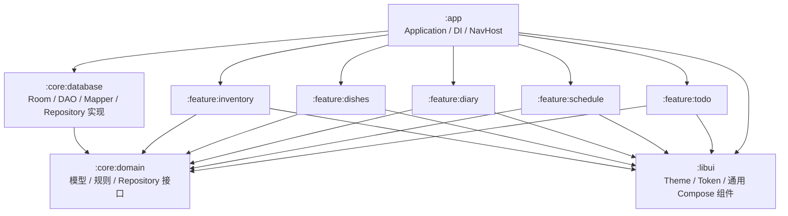

# LifePlanner

LifePlanner 是一款离线优先的 Android 个人生活管理应用，用统一的任务、日程、日记、菜品、库存与采购模型降低日常记录成本。

## 功能

- **任务**：Dialog 新增、长按修改、置顶、DDL、重复规则、完成/跳过、归档和今日日程同步展示。
- **日程**：月历、24 小时时间轴、完成标记、时间冲突提示，以及按早午晚细化事项与地点的八步快速安排；向导末步可直接创建当日待办。
- **日记**：按日期记录开心与不开心的紧凑条目和完整正文；支持预览、修改、删除，并通过独立编辑页原子保存全部草稿后返回。
- **菜品**：食材与熟食余量、保质期、存放位置、临期提示和快速安排中的可用菜品概览。
- **库存**：数量、百分比、状态三种记录方式和低库存提醒。
- **采购**：自动汇总低库存项目，也支持手动添加与购入量回写。

应用面向单用户和本地数据，不包含账号、云同步、多人协作与系统通知。

## 技术栈

| 领域 | 技术 |
|---|---|
| UI | Jetpack Compose + Material 3 |
| 导航 | Navigation Compose 类型安全路由 |
| 状态 | MVI + StateFlow |
| 依赖注入 | Koin |
| 数据 | Room |
| 异步 | Kotlin Coroutines + Flow |
| 构建 | Gradle KTS + Version Catalog |

## 模块架构



依赖方向固定为：

```text
app → feature-* → core:domain
app → feature-* → libui
app → core:database → core:domain
```

模块职责：

| 模块 | 职责 |
|---|---|
| `:app` | Application、Koin 组装、NavHost 和底部导航 |
| `:libui` | 颜色、字体、形状、尺寸、动效 token 和无业务状态组件 |
| `:core:domain` | 领域模型、Repository 接口和纯 Kotlin 规则 |
| `:core:database` | Room Entity、DAO、Mapper 和 Repository 实现 |
| `:feature:*` | 页面、UiState、ViewModel 与 Feature 内交互 |

Feature 之间不直接依赖；Feature 不访问 DAO 或 Room Entity；`libui` 不包含 ViewModel、Repository、导航或业务模型。

主界面采用“任务 → 日程 → 日记 → 菜品 → 库存”五个类型安全顶层目的地。日记完整编辑使用 `:feature:diary` 内的独立 `DiaryEditorActivity`，由 `:app` 负责注册和启动。

当前 Room schema 为 v8。v7 → v8 迁移只新增 `diary_entry` 与 `diary_day`，既有任务、日程、快速安排、库存和采购数据结构保持不变。

## UI 设计系统

当前设计语言为 **Calm Playful（克制活力）**：

- 使用 Material 3 的语义色、字体阶梯、形状和可访问性基础。
- 用明亮绿色和圆润几何表达轻松感。
- 仅主操作按钮保留 3D 按压反馈，卡片和普通控件使用克制的色调层级。
- 所有可点击控件触控目标不低于 48dp。
- 页面尺寸只能引用 `libui/theme/Tokens.kt` 中的 token。

完整规范见 [项目 UI 交互语言设计](项目ui交互语言设计.md)。

通用组件位于 `libui/src/main/java/com/example/libui/components`：

- `AppButton`：Primary、Secondary、Outline、Text、Danger 五级按钮。
- `AppCard`：Default、Tonal、Selected 三种容器层级。
- `AppChoiceChip`：统一单选/多选视觉与 48dp 触控高度。
- `AppTopBar` / `AppFab`：统一页面导航与新增入口；FAB 在固定 56dp 内同时显示图标和短标签。
- `AppDateNavigator`：五格日期视口支持横向滑动，以圆点显示各页面自己的记录状态，以描边标识今天；初始缓存选中日 ±10 天，触边后按 10 天扩展，选中日期变化或点击“回今天”时重居中，长按打开日期选择器。
- `AppLoadingState` / `AppEmptyState` / `AppErrorState`：统一反馈状态。
- `AppStatusBadge` / `AppSectionHeader`：统一状态与信息层级。

## 开发约束

- 新业务规则优先写入 `core:domain`，不要埋在 Composable 或 ViewModel。
- Feature 通过 Repository 接口读取和修改数据，不直接依赖数据库实现。
- 页面使用 `UiState` 作为单一数据源，一次性导航与提示使用 Effect。
- 新 UI 优先复用 `libui` 组件；没有复用价值的 Feature 私有组件留在 Feature 内。
- 不在页面中新增任意 `dp`、颜色值或动画时长；确有新规格时先扩展 token。
- 状态不能只靠颜色区分，必须配合文字、图标或形状。
- 项目不维护自动化测试源码与测试依赖；默认质量门禁为 `.\gradlew.bat lintDebug --console=plain`。
